# Payment Frontend Flow & Reconciliation Specification — Kitty App

**Project**: Swastik Jewellers Kitty App (Sub-Brand: Kitty Vault)  
**Primary Codebase**: `D:\kitty_app\`  
**Document Status**: Synchronized with Current Implementation  
**Last Audit Date**: 2026-09-23  

---

## 1. Transaction Pipeline Overview

The payment pipeline coordinates between client UI, GoKwik payment gateway, backend webhooks, and bank reconciliation polling:

```mermaid
sequenceDiagram
    autonumber
    actor Patron as Patron (Mobile App)
    participant Sheet as CheckoutScreen (/checkout)
    participant Controller as PaymentController
    participant Gateway as GoKwikGatewayScreen
    participant Backend as Backend API
    participant Receipt as ReceiptScreen (/receipt/:id)

    Patron->>Sheet: Clicks "PAY INSTALLMENT"
    Sheet->>Controller: setInstallmentContext(membershipId, chitToken, month, amount)
    Controller->>Backend: POST /api/v1/payments/create-order
    Backend-->>Controller: { orderId, paymentUrl }
    Controller->>Gateway: Opens GoKwik Webview
    Patron->>Gateway: Completes UPI / NetBanking / Card Payment
    Gateway-->>Controller: Gateway Callback (SUCCESS)
    
    rect rgb(20, 45, 35)
        Note over Controller,Backend: Bank Reconciliation Polling Loop (Max 5 attempts x 3s)
        loop Up to 5 Attempts
            Controller->>Backend: POST /api/v1/payments/verify-payment
            Backend-->>Controller: { status: "SUCCESS", receiptId: "REC-..." }
        end
    end

    Controller->>Sheet: Renders PaymentResultView (Success)
    Patron->>Sheet: Clicks "View Digital Receipt"
    Sheet->>Receipt: Opens /receipt/:id
```



---

## 2. Granular Screen States & Reconciliation Handling

### 2.1 Context Pre-population
When `/checkout` is opened, it accepts optional `CheckoutArgs`:
* `membershipId` (e.g. `mem_994411`)
* `chitToken` (e.g. `#SW-042`)
* `monthFor` (e.g. Month 9)
* `amount` (e.g. ₹5,000)
If opened without arguments, it automatically extracts the context from the active scheme in `dashboardControllerProvider`.

### 2.2 Payment Method Selection & Interactive State
Supported payment rails:
1. **UPI Instant Checkout** (Google Pay, PhonePe, Paytm, BHIM)
2. **Net Banking** (All major Indian scheduled banks)
3. **Debit & Credit Cards** (Visa, MasterCard, RuPay)
4. **Pick Cash** (Doorstep cash collection service by Swastik bonded courier)

> [!NOTE]
> **Bug Fix (2026-09-24)**: The payment method selection bug where tapping Net Banking or Card failed to highlight or update state has been cleanly resolved. Selection is now governed by the `PaymentChannel` enum in `PaymentState` (`paymentController.selectChannel(channel)`), which synchronously updates active radio buttons, 1.5px gold borders, and ambient champagne glows.

### 2.3 Reconciliation Polling State (`isPolling`)
* After payment callback, client triggers a polling loop.
* Polling Interval: 3 seconds.
* Maximum Iterations: 5 attempts (total 15 seconds).
* Displays a luxury animated progress indicator with status text: *"Verifying payment confirmation with your bank..."*.

### 2.4 Cancelation Protection Guard
* Handled via `PopScope`:
```dart
if (paymentState.isPolling) {
  showDialog(
    title: "Reconciliation In Progress",
    content: "Your payment is currently being verified with the bank. If you leave, verification will continue in the background and your passbook will update upon completion."
  );
}
```

### 2.5 Success Outcome & Tax Invoice Receipt
* On completion, displays a gold verified badge, transaction ID, paid timestamp, and "VIEW DIGITAL RECEIPT" button that navigates directly to `/receipt/:id`.

---

### 2.6 Doorstep "Pick Cash" Pipeline (`PickCashSheet`)

When the patron selects **"PICK CASH"** as their payment method:

1. **Modal Ingestion Sheet**:
   - Opens `PickCashSheet` in the Warm Luxury aesthetic.
   - Pre-fills verified patron name, phone number, email, and scheme installment amount from active session data.
2. **Captured Information**:
   - **Street Address**: Required text field.
   - **City**: Required text field (default "Lucknow").
   - **PIN Code**: Exactly 6 numeric digits with real-time validation.
   - **Pickup Time Window**: Preset luxury chips (`Morning: 10AM - 1PM`, `Afternoon: 2PM - 5PM`, `Evening: 5PM - 8PM`).
   - **Patron Notes**: Optional instructions for the bonded courier executive.
3. **Statutory PMLA Gate**:
   - Enforces a client-side ceiling of **₹1,99,999** for cash collections. Transactions exceeding ₹50,000 notify the patron of mandatory PAN collection during handover.
4. **Outcome Confirmation**:
   - Generates an official pickup reference code (`PCK-XXXXXX`).
   - Generates a **6-Digit Handover OTP** that the patron must present to the bonded courier upon physical identity verification.
5. **Backend Handoff Contract**:
   - Prepared data model for future submission to `POST /api/v1/payments/cash-pickup`.

